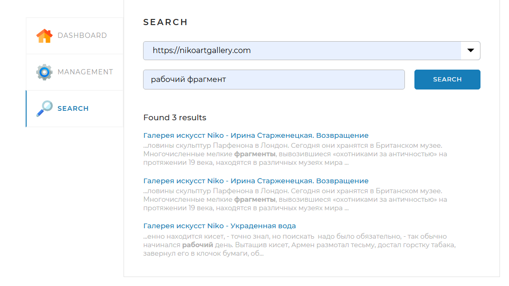

# SearchEngine

Поисковый движок. Полноценный проект включающий в себя:
* Frontend
* Backend
    * Сервис индексации страниц сайтов (работает в многопоточном режиме)
    * Сервис лемматизаии страниц
    * Переиндексация отдельных страниц
    * Поисковый алгоритм
    * Алгоритм построения сниппетов
    * Статистика

## Стэк
* Java 18
* SpringBoot
* MySQL 8
* Apache Lucene
* jsoup
* SL4J
* Lombok

## Инструкция
### Заполнение application.yaml
* Заполнить раздел с сайтами для индексации

* Заполнить поля для подключения к БД

### Использование приложения
При локальном запуске приложение стартует на http://localhost:8080
#### Индексация страниц
* `START INDEXING` - запускает индексацию всех сайтов из `application.yaml`
* `STOP INDEXING` - останавливает индексацию всех сайтов
* `Add/update page` - запускает добавление, обновление индекса страницы сайта

#### Dashboard
Здесь можно увидеть ход выполнения индексации

#### Страница поиска
В выпадающем меню можно выбрать сайт для поиска или поиск по всем сайтам. В поле `Query` вводим запрос для поиска

Пример запроса:

### Особенности
Библиотеки Apache Lucene добавлены непосредственно в проект в директорию lib

